# MyEstate.com

**MyEstate.com** is a comprehensive real estate web application designed to revolutionize the process of buying, selling, and renting properties. Built on the MERN (MongoDB, Express.js, React.js, Node.js) stack, this platform integrates advanced functionalities like saved searches, price prediction, booking, authentication, profile management, and an intuitive search interface.

## Table of Contents

- [Abstract](#abstract)
- [Environmental Setup](#environmental-setup)
  - [Backend (Node.js/Express)](#backend-nodejsexpress)
  - [Frontend (React.js)](#frontend-reactjs)
  - [Price Prediction (Flask)](#price-prediction-flask)
- [Libraries and Applications](#libraries-and-applications)
- [Screenshots](#screenshots)

## Abstract

**MyEstate.com** addresses the challenges and complexities inherent in the current real estate market by providing users with a seamless and user-friendly experience. The platform offers a price prediction service that allows users to determine property prices based on various biases. It also includes an extensive search feature that lets users find their desired property and save searches, with notifications sent when new properties that meet their criteria are listed.

**MyEstate.com** represents a significant step forward in the evolution of real estate technology, offering a comprehensive solution to the evolving needs of buyers, sellers, and renters.

## Environmental Setup

### Backend (Node.js/Express)

1. **Install Node.js and npm:**
   - Update your package list: `sudo apt update`
   - Install Node.js and npm: `sudo apt install nodejs npm`
   - Verify the installation: `node -v` and `npm -v`

2. **Clone the Repository:**
   - `git clone <repository-url>`

3. **Navigate to the Project Directory:**
   - `cd <your-project-directory>`

4. **Install Project Dependencies:**
   - `npm install`

5. **Start the Development Server:**
   - `npm run dev` (starts the server with nodemon)

6. **Start the Application:**
   - `npm start` (starts the server with node)

### Frontend (React.js)

1. **Install Node.js and npm:**
   - Update your package list: `sudo apt update`
   - Install Node.js and npm: `sudo apt install nodejs npm`
   - Verify the installation: `node -v` and `npm -v`

2. **Install Vite:**
   - `npm install -g create-vite`

3. **Create React App:**
   - `npx create-react-app <project-name>`

4. **Set up Axios:**
   - `npm install axios`

5. **Navigate to the Client Directory:**
   - `cd client`

6. **Install Project Dependencies:**
   - `npm install`

7. **Install Tailwind CSS:**
   - `npm install tailwindcss`
   - Initialize Tailwind CSS: `npx tailwindcss init`

8. **Start the Development Server:**
   - `npm run dev`

9. **Build the Project:**
   - `npm run build`

10. **Lint the Project:**
    - `npm run lint`

11. **Preview the Project:**
    - `npm run preview`

### Price Prediction (Flask)

1. **Update your Package List:**
   - `sudo apt update`

2. **Install Python and pip:**
   - Install Python: `sudo apt install python3`
   - Install pip: `sudo apt install python3-pip`
   - Verify the installation: `python3 --version` and `pip3 --version`

3. **Create a New Directory for Your Flask Project:**
   - `mkdir <your-project-directory>`

4. **Navigate to the Project Directory:**
   - `cd <your-project-directory>`

5. **Create Python Files for Your Flask Application:**
   - `touch server.py` and `touch util.py`

6. **Install Project Dependencies:**
   - `pip3 install -r requirements.txt`
   - This includes:
     - `numpy`
     - `geopy`
     - `scikit-learn==1.2.2`
     - `flask`
     - `flask-cors`

7. **Start the Flask Server:**
   - Set the FLASK APP environment variable: `export FLASK_APP=<your-flask-app>`
   - Start the server: `flask run`

## Libraries and Applications

### Client-side (React.js)
- **React Router:** Client-side routing
- **Redux:** State management
- **React-Leaflet:** Interactive maps
- **Lottie-React:** Animations
- **React-Icons:** Popular icon libraries
- **Swiper:** Responsive carousels and sliders
- **Tailwind CSS:** Styling and UI components

### Server-side (Node.js/Express)
- **Express:** API and HTTP request handling
- **MongoDB (Mongoose):** Database management and object data modeling
- **JSON Web Token (JWT):** User authentication and authorization
- **Nodemailer:** Sending transactional emails
- **Bcrypt:** Hashing and salting passwords
- **Axios:** HTTP requests from the server

### Price Prediction (Flask)
- **NumPy:** Numerical computations
- **Geopy:** Geocoding and location-based operations
- **Scikit-learn:** Machine learning model building and training
- **Flask:** Price prediction API
- **Flask-CORS:** Cross-Origin Resource Sharing (CORS) handling
- **Nominatim:** Geocoding and reverse geocoding

## Screenshots

## Screenshots
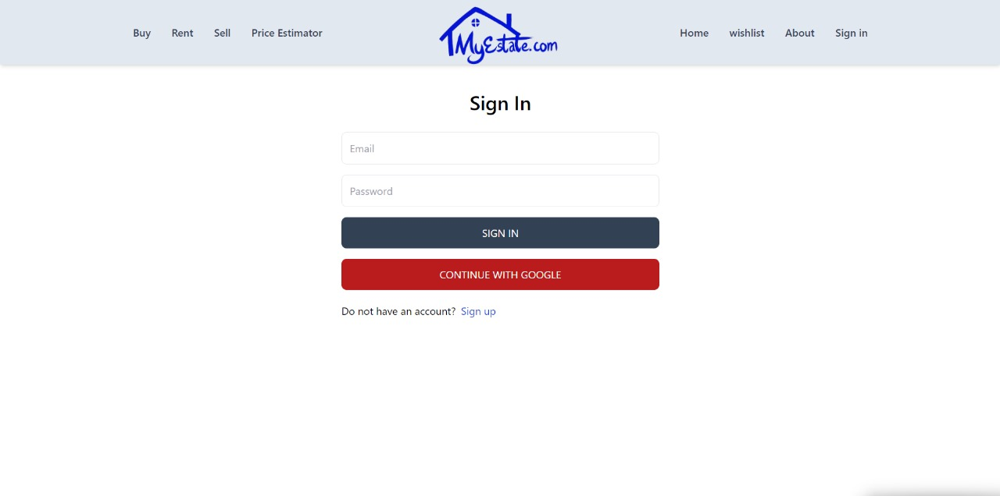
*Login Page of MyEstate.com*

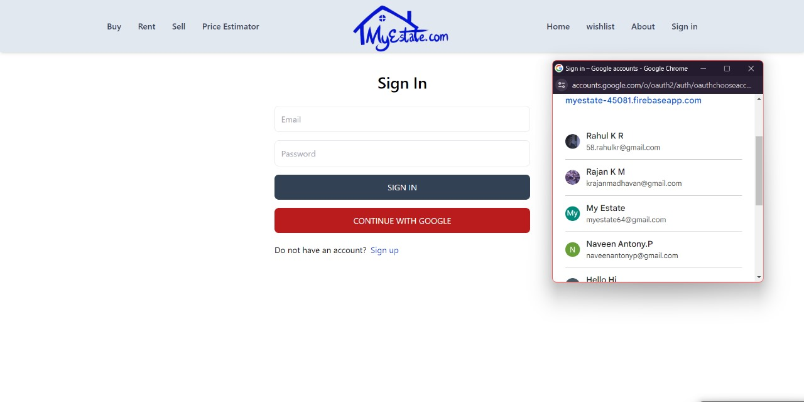
*Login Page of MyEstate.com*

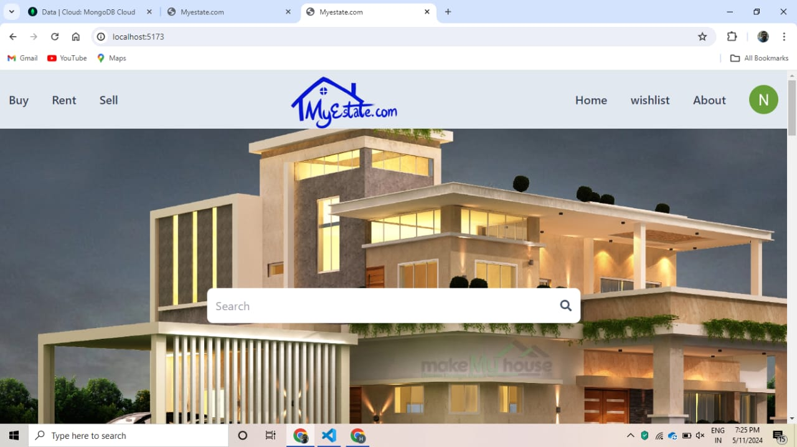
*Homepage of MyEstate.com*

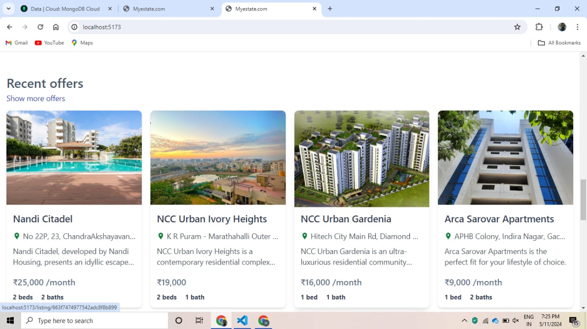
*Property listing page displaying available properties*

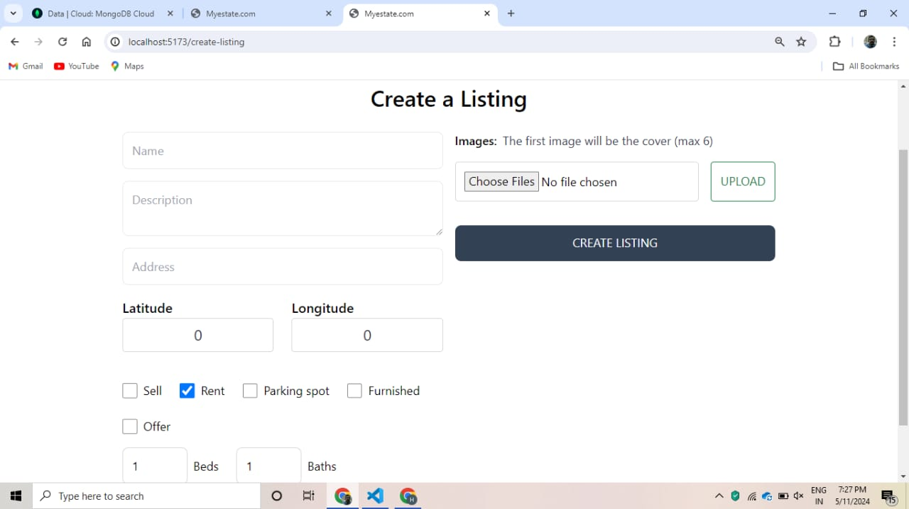
*Create a Listing Page of MyEstate.com*

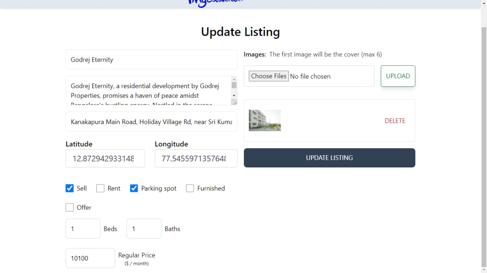
*Update a Listing Page of MyEstate.com*

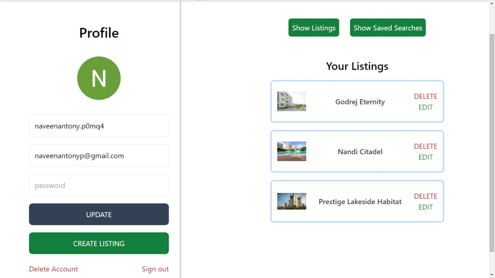
*Profile Page of MyEstate.com*

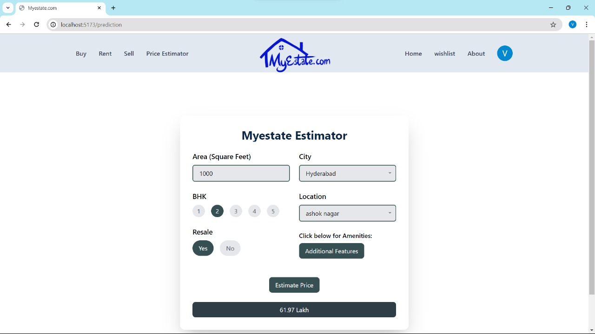
*Price Prediction page of MyEstate.com*

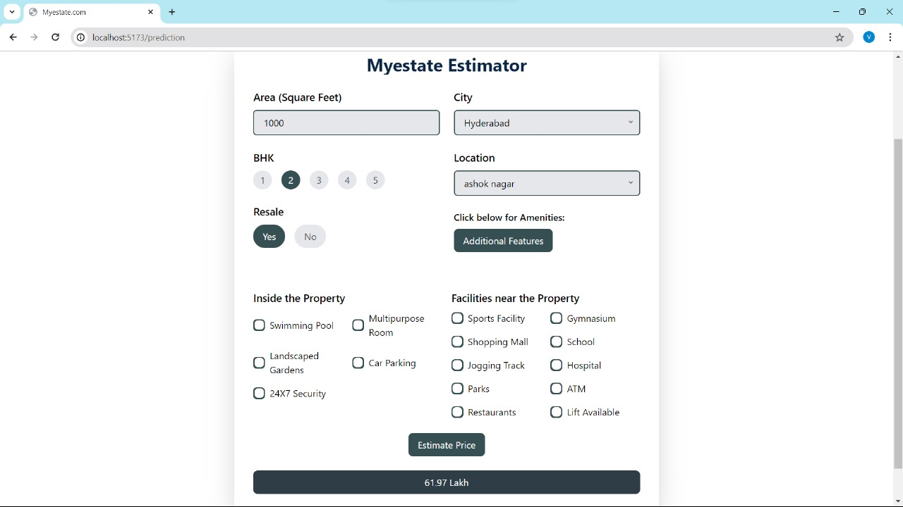
*All features of Price Prediction model of MyEstate.com*

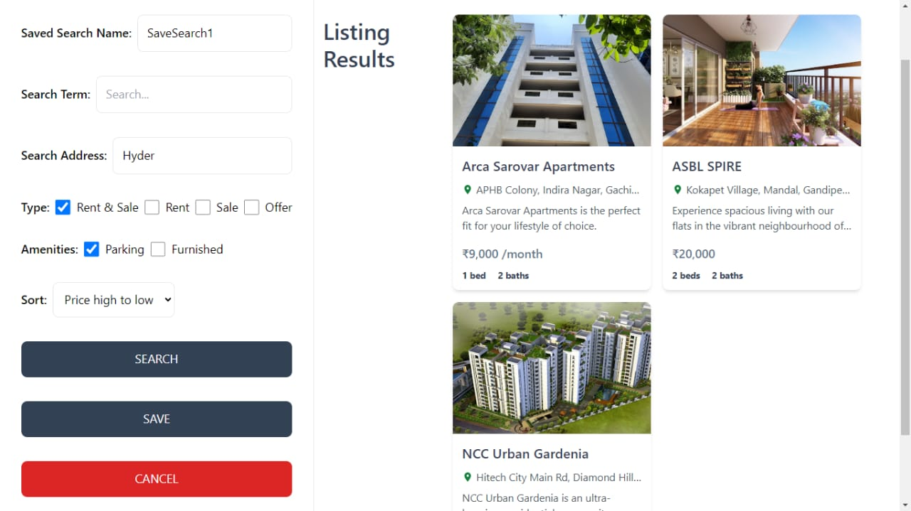
*Saved Search feature of MyEstate.com*

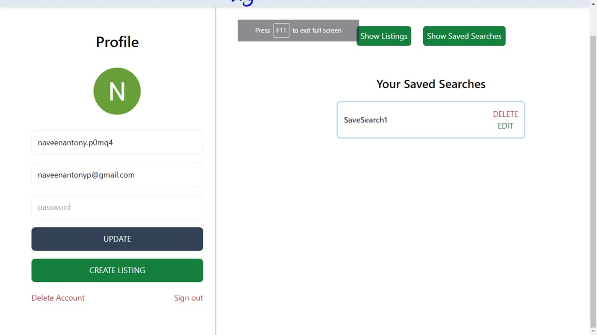
*Saved Searches page of MyEstate.com*

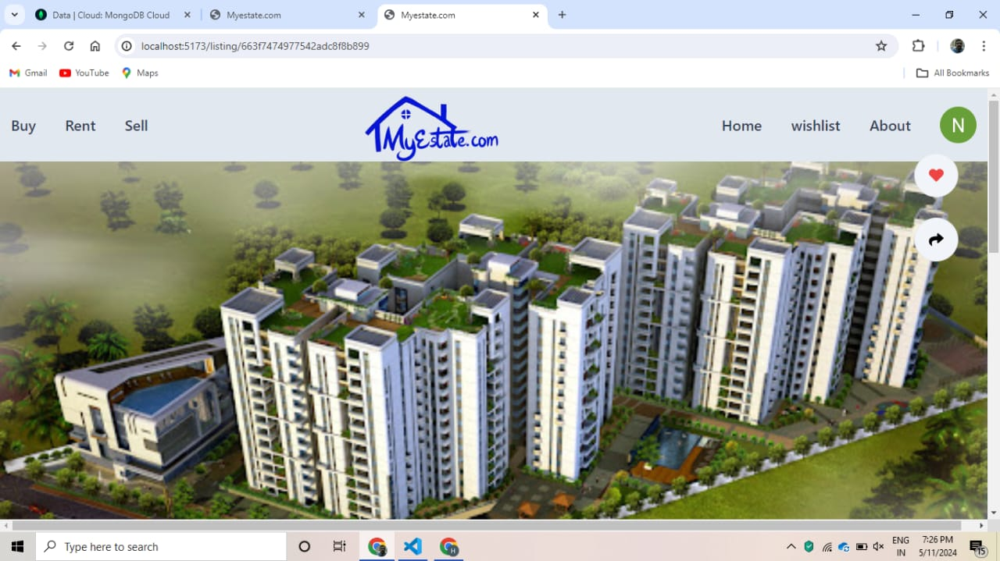
*Property Page of MyEstate.com*

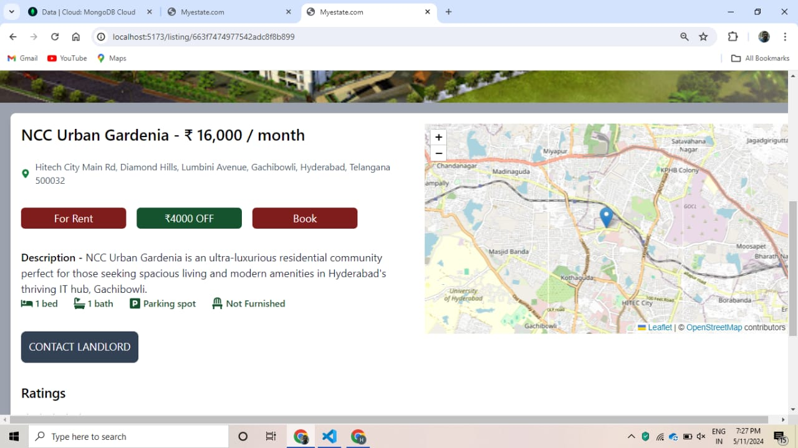
*Map Feature of MyEstate.com*

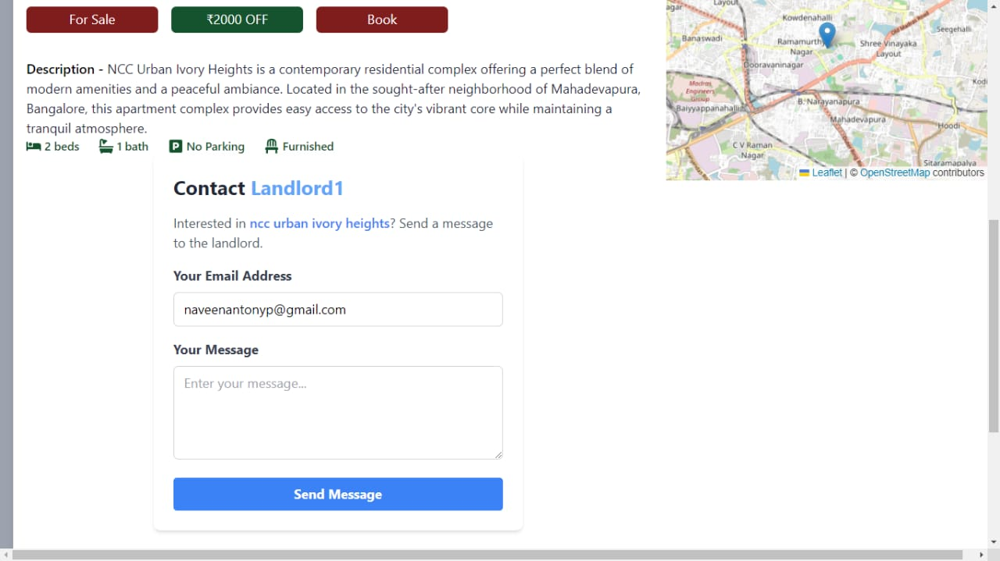
*Contact Landlord Feature of MyEstate.com*

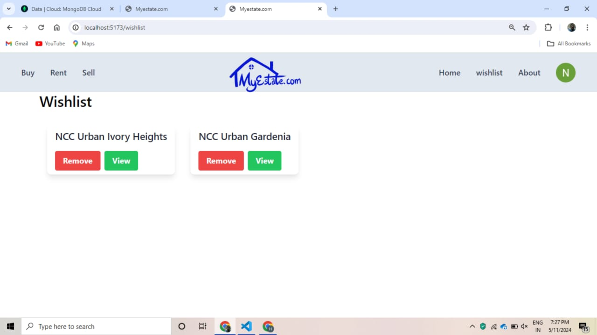
*Wishlist Feature of MyEstate.com*

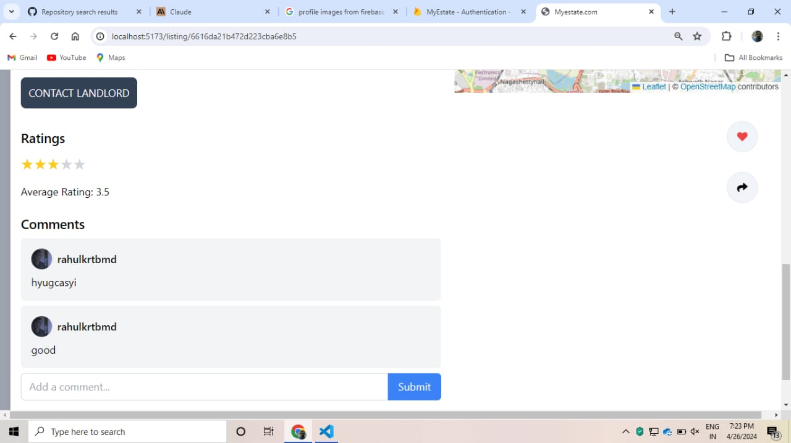
*Review and Rating Feature of MyEstate.com*

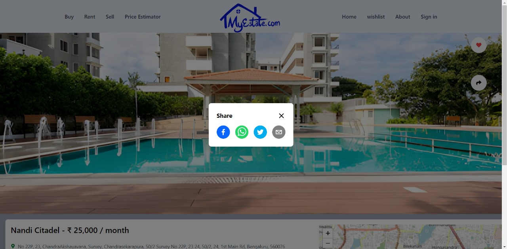
*Share Feature of MyEstate.com*